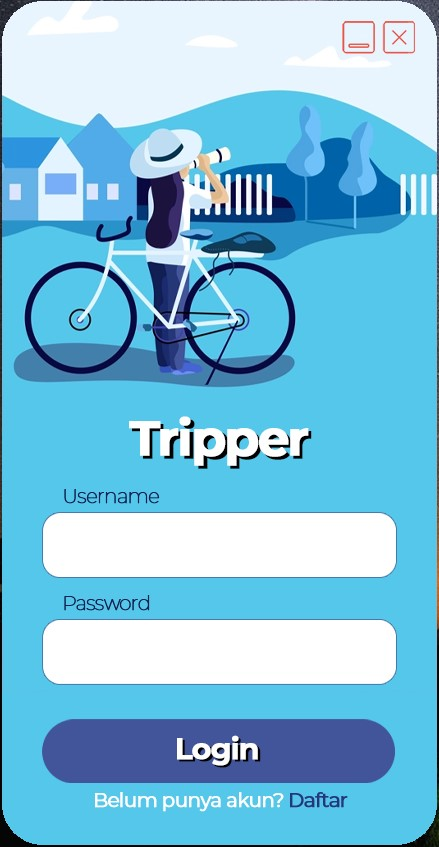
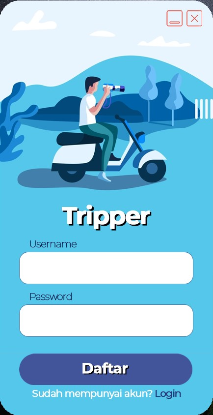
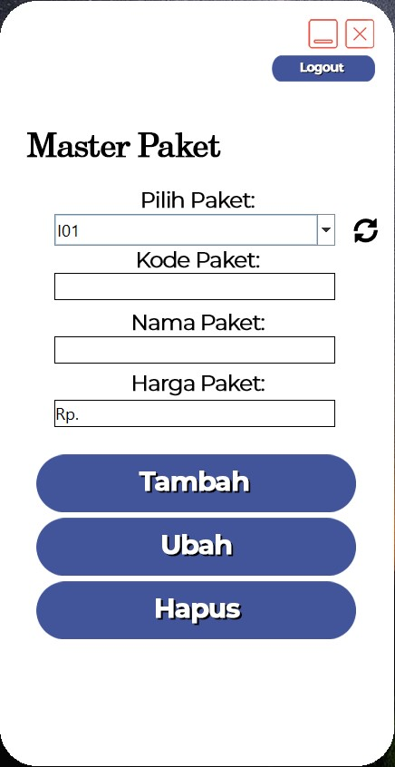
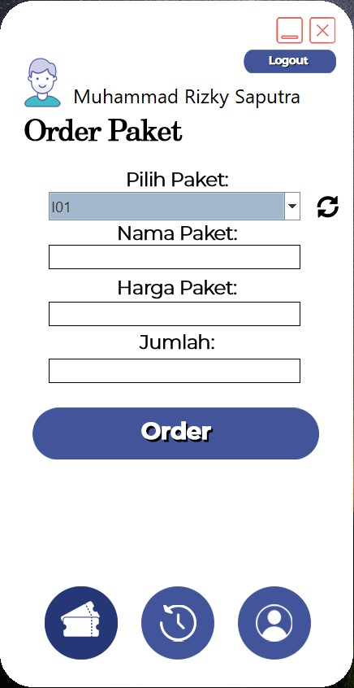

<a name="readme-top"></a>

<br />
<div align="center">
  <a href="https://github.com/Mythologica404/tripper">
    
  </a>

  <h3 align="center"><b>Tripper</b></h3>

  <p align="center">
    Sebuah aplikasi tentang pemesanan paket travel. Aplikasi ini dibuat sebagai tugas akhir dari Mata Kuliah Pemgrograman Berbasis Objek. Dibuat menggunakan bahasa pemrograman Java dan library JFrame serta database SQL dengan phpmyadmin.
  </p>
</div>

<details>
  <summary>Table of Contents</summary>
  <ol>
    <li>
      <a href="#about-the-project">About The Project</a>
      <ul>
        <li><a href="#built-with">Built With</a></li>
      </ul>
    </li>
    <li>
      <a href="#getting-started">Getting Started</a>
      <ul>
        <li><a href="#prerequisites">Prerequisites</a></li>
        <li><a href="#installation">Installation</a></li>
      </ul>
    </li>
    <li><a href="#usage">Usage</a></li>
    <li><a href="#roadmap">Roadmap</a></li>
    <li><a href="#contributing">Contributing</a></li>
    <li><a href="#license">License</a></li>
    <li><a href="#contact">Contact</a></li>
    <li><a href="#acknowledgments">Acknowledgments</a></li>
  </ol>
</details>

<!-- ABOUT THE PROJECT -->

## About The Project

Aplikasi ini merupakan aplikasi yang dibuat sebagai Tugas Akhir dari bagian Ujian Akhir Semester untuk Mata Kuliah Pemrograman Berbasis Objek. Aplikasi ini merupakan aplikasi untuk pemesanan paket travel. User pada aplikasi ini terbagi menjadi 3. Master Paket, New User, dan User.

Master Paket bisa mengakses panel admin untuk menambah atau menghapus paket yang tersedia.

User bisa mengakses panel user, bisa memesan paket yang ada.

New User sama seperti user, namun tidak bisa mengakses panel lain sebelum melengkapi biodata yang ada.

<p align="right">(<a href="#readme-top">back to top</a>)</p>

### Built With

Aplikasi ini dibuat menggunakan Java dengan JFrame sebagai librarynya, dan MySQL sebagai databasenya.

[![Java][java]][java-url]<br>
[![Java][mysql]][mysql-url]

<p align="right">(<a href="#readme-top">back to top</a>)</p>

## Getting Started

Clone git ini ke folder project kalian.

```sh
git clone Mythologica404/tripper
```

Buat database dengan tabel dan relasi sebagai berikut:

<div align="center">
    
</div>

Terakhir, lakukan konfigurasi pada Main Class (Tripper). Lakukan konfigurasi pada method getKoneksi(). Silahkan sesuaikan dengan database yang kalian gunakan.

```java
public static Connection getKoneksi() throws SQLException {
    String username = "root";
    String password = "";
    String hostname = "localhost";
    String database = "tripper";

    ...
}
```

Silahkan jalankan aplikasi kalian.

<p align="right">(<a href="#readme-top">back to top</a>)</p>

## Screenshoot

Berikut adalah beberapa tampilan aplikasi saat dijalankan

<div align="center">
    
    <p><i>Tampilan Login Page</i></p>
</div>

<div align="center">
    
    <p><i>Tampilan Register Page</i></p>
</div>

<div align="center">
    
    <p><i>Tampilan Master Paket Page</i></p>
</div>

<div align="center">
    
    <p><i>Tampilan User Page</i></p>
</div>

<p align="right">(<a href="#readme-top">back to top</a>)</p>

[java]: https://img.shields.io/badge/java-%23ED8B00.svg?style=for-the-badge&logo=java&logoColor=white
[java-url]: https://www.java.com
[mysql]: https://img.shields.io/badge/mysql-%2300f.svg?style=for-the-badge&logo=mysql&logoColor=white
[mysql-url]: https://www.mysql.com
